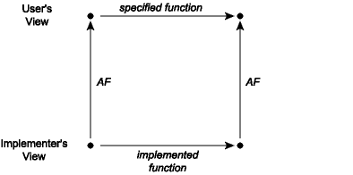

# Commutative Diagrams

Using the abstraction function, we can now talk about what it means for
an implementation of an abstraction to be *correct*. It is correct
exactly when every operation that takes place in the concrete space
makes sense when mapped by the abstraction function into the abstract
space. This can be visualized as a *commutative diagram*:

A commutative diagram means that if we take the two paths around the
diagram, we have to get to the same place. Suppose that we start from a
concrete value and apply the actual implementation of some operation to
it to obtain a new concrete value or values. When viewed abstractly, a
concrete result should be an abstract value that is a possible result of
applying the function *as described in its specification* to the
abstract view of the actual inputs. For example, consider the union
function from the implementation of sets as lists with repeated elements
covered last time. When this function is applied to the concrete pair
[1; 3], [2; 2], it corresponds to the lower-left corner of the diagram.
The result of this operation is the list [2; 2; 1; 3], whose
corresponding abstract value is the list {1, 2, 3}. Note that if we
apply the abstraction function AF to the input lists [1; 3] and [2; 2],
we have the sets {1, 3} and {2}. The commutative diagram requires that
in this instance the union of {1, 3} and {2} is {1, 2, 3}, which is of
course true.
