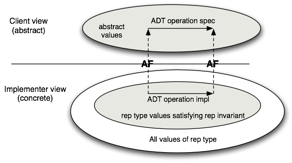

---
jupytext:
  cell_metadata_filter: -all
  formats: md:myst
  text_representation:
    extension: .md
    format_name: myst
    format_version: 0.13
    jupytext_version: 1.10.3
kernelspec:
  display_name: OCaml
  language: OCaml
  name: ocaml-jupyter
---

# Module Documentation

{{ video_embed | replace("%%VID%%", "4OTspWNefn4")}}

The specification of functions provided by a module can be found in its
interface, which is what clients will consult. But what about *internal*
documentation, which is relevant to those who implement and maintain a module?
The purpose of such implementation comments is to explain to the reader how the
implementation correctly implements its interface.

```{admonition} Reminder
It is inappropriate to copy the specifications of functions found in the module
interface into the module implementation. Copying runs the risk of introducing
inconsistency as the program evolves, because programmers don't keep the copies
in sync. Copying code and specifications is a major source (if not *the* major
source) of program bugs. In any case, implementers can always look at the
interface for the specification.
```

Implementation comments fall into two categories. The first category arises
because a module implementation may define new types and functions that are
purely internal to the module. If their significance is not obvious, these types
and functions should be documented in much the same style that we have suggested
for documenting interfaces. Often, as the code is written, it becomes apparent
that the new types and functions defined in the module form an internal data
abstraction or at least a collection of functionality that makes sense as a
module in its own right. This is a signal that the internal data abstraction
might be moved to a separate module and manipulated only through its operations.

The second category of implementation comments is associated with the use of
*data abstraction*. Suppose we are implementing an abstraction for a set of
items of type `'a`. The interface might look something like this:

```{code-cell} ocaml
:tags: ["hide-output"]
(** A set is an unordered collection in which multiplicity is ignored. *)
module type Set = sig

  (** ['a t] represents a set whose elements are of type ['a] *)
  type 'a t

  (** [empty] is the set containing no elements *)
  val empty : 'a t

  (** [mem x s] is whether [x] is a member of set [s] *)
  val mem : 'a -> 'a t -> bool

  (** [add x s] is the set containing all the elements of [s]
      as well as [x]. *)
  val add : 'a -> 'a t -> 'a t

  (** [rem x s] is the set containing all the elements of [s],
      minus [x]. *)
  val rem : 'a -> 'a t -> 'a t

  (** [size s] is the cardinality of [s] *)
  val size: 'a t -> int

  (** [union s1 s2] is the set containing all the elements that
      are in either [s1] or [s2]. *)
  val union: 'a t -> 'a t -> 'a t

  (** [inter s1 s2] is the set containing all the elements that
      are in both [s1] and [s2]. *)
  val inter: 'a t -> 'a t -> 'a t
end
```

In a real signature for sets, we'd want operations such as `map` and `fold` as
well, but let's omit these for now for simplicity. There are many ways to
implement this abstraction.

{{ video_embed | replace("%%VID%%", "abtrrowewaw")}}

As we've seen before, one easy way is as a list:

```{code-cell} ocaml
(** Implementation of sets as lists with duplicates *)
module ListSet : Set = struct
  type 'a t = 'a list
  let empty = []
  let mem = List.mem
  let add = List.cons
  let rem x = List.filter (( <> ) x)
  let size lst = List.(lst |> sort_uniq Stdlib.compare |> length)
  let union lst1 lst2 = lst1 @ lst2
  let inter lst1 lst2 = List.filter (fun h -> mem h lst2) lst1
end
```

This implementation has the advantage of simplicity. For small sets that tend
not to have duplicate elements, it will be a fine choice. Its performance will
be poor for large sets or applications with many duplicates but for some
applications that's not an issue.

Notice that the types of the functions do not need to be written down in the
implementation. They aren't needed because they're already present in the
signature, just like the specifications that are also in the signature don't
need to be replicated in the structure.

{{ video_embed | replace("%%VID%%", "n8irzSGGVao")}}

Here is another implementation of `Set` that also uses `'a list` but requires
the lists to contain no duplicates. This implementation is also correct (and
also slow for large sets). Notice that we are using the same representation
type, yet some important aspects of the implementation (`add`, `size`,
`union`) are quite different.

```{code-cell} ocaml
(** Implementation of sets as lists without duplicates *)
module UniqListSet : Set = struct
  type 'a t = 'a list
  let empty = []
  let mem = List.mem
  let add x lst = if mem x lst then lst else x :: lst
  let rem x = List.filter (( <> ) x)
  let size = List.length
  let union lst1 lst2 = lst1 @ lst2 |> List.sort_uniq Stdlib.compare
  let inter lst1 lst2 = List.filter (fun h -> mem h lst2) lst1
end
```

An important reason why we introduced the writing of function specifications was
to enable *local reasoning*: once a function has a spec, we can judge whether
the function does what it is supposed to without looking at the rest of the
program. We can also judge whether the rest of the program works without looking
at the code of the function. However, we cannot reason locally about the
individual functions in the three module implementations just given. The problem
is that we don't have enough information about the relationship between the
concrete type (`int list`) and the corresponding abstract type (`set`). This
lack of information can be addressed by adding two new kinds of comments to the
implementation: the *abstraction function* and the *representation invariant*
for the abstract data type. We turn to discussion of those, next.

## Abstraction Functions

{{ video_embed | replace("%%VID%%", "ZYYa66804Q4")}}

The client of any `Set` implementation should not be able to distinguish it from
any other implementation based on its functional behavior. As far as the client
can tell, the operations act like operations on the mathematical ideal of a set.
In the first implementation, the lists `[3; 1]`, `[1; 3]`, and `[1; 1; 3]` are
distinguishable to the implementer, but not to the client. To the client, they
all represent the abstract set {1, 3} and cannot be distinguished by any of the
operations of the `Set` signature. From the point of view of the client, the
abstract data type describes a set of abstract values and associated operations.
The implementer knows that these abstract values are represented by concrete
values that may contain additional information invisible from the client's view.
This loss of information is described by the *abstraction function*, which is a
mapping from the space of concrete values to the abstract space. The abstraction
function for the implementation `ListSet` looks like this:


Notice that several concrete values may map to a single abstract value;
that is, the abstraction function may be *many-to-one*. It is also
possible that some concrete values do not map to any abstract value; the
abstraction function may be *partial*. That is not the case with `ListSet`,
but it might be with other implementations.

The abstraction function is important for deciding whether an
implementation is correct, therefore it belongs as a comment in the
implementation of any abstract data type. For example, in the `ListSet`
module, we could document the abstraction function as follows:

```ocaml
module ListSet : Set = struct
  (** Abstraction function: The list [[a1; ...; an]] represents the
      set [{b1, ..., bm}], where [[b1; ...; bm]] is the same list as
      [[a1; ...; an]] but with any duplicates removed. The empty list
      [[]] represents the empty set [{}]. *)
  type 'a t = 'a list
  ...
end
```

This comment explicitly points out that the list may contain duplicates, which
is helpful as a reinforcement of the first sentence. Similarly, the case of an
empty list is mentioned explicitly for clarity, although some might consider it
to be redundant.

The abstraction function for the second implementation, which does not allow
duplicates, hints at an important difference. We can write the abstraction
function for this second representation a bit more simply because we know that
the elements are distinct.

```ocaml
module UniqListSet : Set = struct
  (** Abstraction function: The list [[a1; ...; an]] represents the set
      [{a1, ..., an}]. The empty list [[]] represents the empty set [{}]. *)
  type 'a t = 'a list
  ...
end
```

## Implementing the Abstraction Function

{{ video_embed | replace("%%VID%%", "ebcnwXuWPI0")}}

What would it mean to implement the abstraction function for `ListSet`? We'd
want a function that took an input of type `'a ListSet.t`. But what should its
output type be? The abstract values are mathematical sets, not OCaml types. If
we did hypothetically have a type `'a set` that our abstraction function could
return, there would have been little point in developing `ListSet`; we could
have just used that `'a set` type without doing any work of our own.

On the other hand, we might implement something close to the abstraction
function by converting an input of type `'a ListSet.t` to a built-in OCaml type
or standard library type:

- We could convert to a `string`. That would have the advantage of being easily
  readable by humans in the toplevel or in debug output. Java programmers use
  `toString()` for similar purposes.

- We could convert to `'a list`. (Actually there's little conversion to be
  done). For data collections this is a convenient choice, since lists can at
  least approximately represent many data structures: stacks, queues,
  dictionaries, sets, heaps, etc.

The following functions implement those ideas.  Note that `to_string` has
to take an additional argument `string_of_val` from the client to convert
`'a` to `string`.

```ocaml
module ListSet : Set = struct
  ...

  let uniq lst = List.sort_uniq Stdlib.compare lst

  let to_string string_of_val lst =
    let interior =
      lst |> uniq |> List.map string_of_val |> String.concat ", "
    in
    "{" ^ interior ^ "}"

  let to_list = uniq
end
```

Installing a custom formatter, as discussed in the
[section on encapsulation][encap], could also be understood as implementing the
abstraction function. But in that case it's usable only by humans at the
toplevel rather than other code, programmatically.

[encap]: ../modules/encapsulation.md

## Commutative Diagrams

{{ video_embed | replace("%%VID%%", "PKAgq97NBdg")}}

Using the abstraction function, we can now talk about what it means for an
implementation of an abstraction to be *correct*. It is correct exactly when
every operation that takes place in the concrete space makes sense when mapped
by the abstraction function into the abstract space. This can be visualized as a
*commutative diagram*:


A commutative diagram means that if we take the two paths around the diagram, we
have to get to the same place. Suppose that we start from a concrete value and
apply the actual implementation of some operation to it to obtain a new concrete
value or values. When viewed abstractly, a concrete result should be an abstract
value that is a possible result of applying the function *as described in its
specification* to the abstract view of the actual inputs. For example, consider
the union function from the implementation of sets as lists with repeated
elements covered last time. When this function is applied to the concrete pair
[1; 3], [2; 2], it corresponds to the lower-left corner of the diagram. The
result of this operation is the list [2; 2; 1; 3], whose corresponding abstract
value is the set {1, 2, 3}. Note that if we apply the abstraction function AF
to the input lists [1; 3] and [2; 2], we have the sets {1, 3} and {2}. The
commutative diagram requires that in this instance the union of {1, 3} and {2}
is {1, 2, 3}, which is of course true.

## Representation Invariants

{{ video_embed | replace("%%VID%%", "mEtR4YGMRPY")}}

The abstraction function explains how information within the module is viewed
abstractly by module clients. But that is not all we need to know to ensure
correctness of the implementation. Consider the `size` function in each of the
two implementations. For `ListSet`, which allows duplicates, we need to be sure
not to double-count duplicate elements:

```ocaml
let size lst = List.(lst |> sort_uniq Stdlib.compare |> length)
```

But for `UniqListSet`, in which the lists have no duplicates, the size is just
the length of the list:

```ocaml
let size = List.length
```

How do we know that latter implementation is correct? That is, how do we know
that "lists have no duplicates"? It's hinted at by the name of the module, and
it can be deduced from the implementation of `add`, but we've never carefully
documented it. Right now, the code does not explicitly say that there are no
duplicates.

In the `UniqListSet` representation, not all concrete data items represent
abstract data items. That is, the *domain* of the abstraction function does not
include all possible lists. There are some lists, such as `[1; 1; 2]`, that
contain duplicates and must never occur in the representation of a set in the
`UniqListSet` implementation; the abstraction function is undefined on such
lists. We need to include a second piece of information, the *representation
invariant* (or *rep invariant*, or *RI*), to determine which concrete data items
are valid representations of abstract data items. For sets represented as lists
without duplicates, we write this as part of the comment together with the
abstraction function:

```ocaml
module UniqListSet : Set = struct
  (** Abstraction function: the list [[a1; ...; an]] represents the set
      [{a1, ..., an}].  The empty list [[]] represents the empty set [{}].
      Representation invariant: the list contains no duplicates. *)
  type 'a t = 'a list
  ...
end
```

If we think about this issue in terms of the commutative diagram, we see that
there is a crucial property that is necessary to ensure correctness: namely,
that all concrete operations preserve the representation invariant. If this
constraint is broken, functions such as `size` will not return the correct
answer. The relationship between the representation invariant and the
abstraction function is depicted in this figure:



We can use the rep invariant and abstraction function to judge whether the
implementation of a single operation is correct *in isolation from the rest of
the functions in the module*. A function is correct if these conditions:

1. The function's preconditions hold of the argument values.
2. The concrete representations of the arguments satisfy the rep invariant.

imply these conditions:

1. All new representation values created satisfy the rep invariant.
2. The commutative diagram holds.

The rep invariant makes it easier to write code that is provably correct,
because it means that we don't have to write code that works for all possible
incoming concrete representations&mdash;only those that satisfy the rep
invariant. For example, in the implementation `UniqListSet`, we do not care what
the code does on lists that contain duplicate elements. However, we do need to
be concerned that on return, we only produce values that satisfy the rep
invariant. As suggested in the figure above, if the rep invariant holds for the
input values, then it should hold for the output values, which is why we call it
an *invariant*.

## Implementing the Representation Invariant

{{ video_embed | replace("%%VID%%", "4bfh_aONcRc")}}

When implementing a complex abstract data type, it is often helpful to write an
internal function that can be used to check that the rep invariant holds of a
given data item. By convention, we will call this function `rep_ok`. If the
module accepts values of the abstract type that are created outside the module,
say by exposing the implementation of the type in the signature, then `rep_ok`
should be applied to these to ensure the representation invariant is satisfied.
In addition, if the implementation creates any new values of the abstract type,
`rep_ok` can be applied to them as a sanity check. With this approach, bugs are
caught early, and a bug in one function is less likely to create the appearance
of a bug in another.

A convenient way to write `rep_ok` is to make it an identity function that just
returns the input value if the rep invariant holds and raises an exception if it
fails.

```ocaml
(* Checks whether x satisfies the representation invariant. *)
let rep_ok x =
  if (* check the RI holds of x *) then x else failwith "RI violated"
```

Here is an implementation of `Set` that uses the same data representation as
`UniqListSet`, but includes copious `rep_ok` checks. Note that `rep_ok` is
applied to all input sets and to any set that is ever created. This ensures that
if a bad set representation is created, it will be detected immediately. In case
we somehow missed a check on creation, we also apply `rep_ok` to incoming set
arguments. If there is a bug, these checks will help us quickly figure out where
the rep invariant is being broken.

```{code-cell} ocaml
(** Implementation of sets as lists without duplicates. *)
module UniqListSet : Set = struct

  (** Abstraction function: The list [[a1; ...; an]] represents the
      set {a1, ..., an}. The empty list [[]] represents the empty set [{}].
      Representation invariant: the list contains no duplicates. *)
  type 'a t = 'a list

  let rep_ok lst =
    let u = List.sort_uniq Stdlib.compare lst in
    match List.compare_lengths lst u with 0 -> lst | _ -> failwith "RI"

  let empty = []

  let mem x lst = List.mem x (rep_ok lst)

  let add x lst = rep_ok (if mem x (rep_ok lst) then lst else x :: lst)

  let rem x lst = rep_ok (List.filter (( <> ) x) (rep_ok lst))

  let size lst = List.length (rep_ok lst)

  let union lst1 lst2 =
    rep_ok
      (List.fold_left
         (fun u x -> if mem x lst2 then u else x :: u)
         (rep_ok lst2) (rep_ok lst1))

  let inter lst1 lst2 = rep_ok (List.filter (fun h -> mem h lst2) (rep_ok lst1))
end

```

Calling `rep_ok` on every argument can be too expensive for the production
version of a program. The `rep_ok` above, for example, requires linearithmic
time, which destroys the efficiency of all the previously constant time or
linear time operations. For production code, it may be more appropriate to use a
version of `rep_ok` that only checks the parts of the rep invariant that are
cheap to check. When there is a requirement that there be no run-time cost,
`rep_ok` can be changed to an identity function (or macro) so the compiler
optimizes away the calls to it. However, it is a good idea to keep around the
full code of `rep_ok` so it can be easily reinstated during future debugging:

```ocaml
let rep_ok lst = lst

let rep_ok_expensive =
  let u = List.sort_uniq Stdlib.compare lst in
  match List.compare_lengths lst u with 0 -> lst | _ -> failwith "RI"
```

Some languages provide support for *conditional compilation*, which provides
some kind of support for compiling some parts of the codebase but not others.
The OCaml compiler supports a flag `noassert` that disables assertion checking.
So you could implement rep invariant checking with `assert`, and turn it off
with `noassert`. The problem with that is that some portions of your codebase
might *require* assertion checking to be turned on to work correctly.
