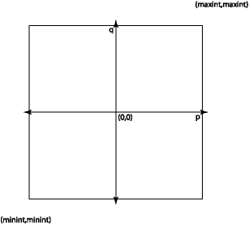

# Test Coverage

We would like to know that a program works on all possible inputs. The
problem with testing is that it is usually infeasible to try all the
possible inputs. For example, suppose that we are implementing a module
that provides an abstract data type for rational numbers. One of its
operations might be an addition function `plus`, e.g.:

```
(** AF: [(p,q)] represents the rational number p/q
    RI: [q] is not 0 *)
type rational = int*int

(** [create p q] is the rational number p/q.
     Raises: [Invalid_argument "0"] if [q] is 0 *)
val create : int -> int -> rational

(** [plus r1 r2] is r1 + r2 *)
val plus : rational -> rational -> rational
```

What would it take to exhaustively test just this one function? We'd
want to try all possible rationals as both the `r1` and `r2` arguments.
A rational is formed from two ints, and there are $$2^{63}$$ ints on a
modern OCaml implementation. Therefore there are approximately
$$(2^{63})^4 = 2^{252}$$ possible inputs to the `plus` function. Even
if we test one addition every nanosecond, it will take about 10^59 years
to finish testing this one function.

Clearly we can't test software exhaustively. But that doesn't mean we
should give up on testing. It just means that we need to think carefully
about what our test cases should be so that they are as effective as
possible at convincing us that the code works.

Consider our `create` function, above. It takes in two integers `p` and
`q` as arguments. How should we go about selecting a relatively small
number of test cases that will convince us that the function works
correctly on all possible inputs? We can visualize the space of all
possible inputs as a large square:



There are about $$2^{126}$$ points in this square, so we can't afford
to test them all. And testing them all is going to mostly be a waste of
time&mdash;most of the possible inputs provide nothing new. We need a
way to find a set of points in this space to test that are interesting
and will give a good sense of the behavior of the program across the
whole space.

Input spaces generally comprise a number of subsets in which the
behavior of the code is similar in some essential fashion across the
entire subset. We don't get any additional information by testing more
than one input from each such subset.

If we test all the interesting regions of the input space, we have
achieved good *coverage*. We want tests that in some useful sense
cover the space of possible program inputs.

Two good ways of achieving coverage are *black-box testing* 
and *glass-box testing*.  We discuss those, next.
